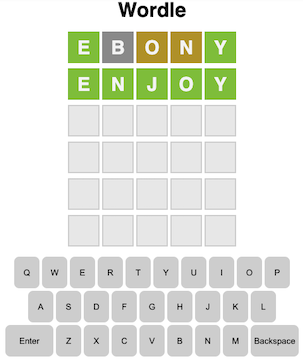

# Wordle

## Description

This is a game where you get 6 chances to guess a 5-letter word.
Hosted at: https://michael-yzhou.github.io/Wordle/

## How to Play

- What does the game look like:

  

- Use the Wordle keyboard to enter your guess and submit your word by hitting the “enter” key on the keyboard.
- The color of the tiles will change after you submit your word. A yellow tile indicates that you picked the right letter but it’s in the wrong spot. The green tile indicates that you picked the right letter in the correct spot. The gray tile indicates that the letter you picked is not included in the word at all.
- Continue until you solve the Wordle or run out of guesses. Good luck!
- You can restart the game at any time by refreshing your browser.

## Languages

- HTML
- CSS
- Javascript

## Key Takeaways

1. Traverse the grid

   I use the Row-Id and Box-Id variables to go through each box in the grid and add eventListener to it, therefore, the keyboard can be connected to the boxes and the winning condition can be checked based on player's input. The Row-Id increments after clicking on the "Enter" key. The Box-Id is increments after clicking on any of the "Letter" key, and it decrements after clicking on the "Backspace" key. Some "if conditions" were added to interupt this process so the game can be paused when the player makes invalid input, or to terminate the game when the player wins/loses.

2. Deal with "out-of-bounds"

   Since there are 30 boxes, my initial plan was to assign 0 to 29 to all boxes as their ID, then select them in Javascript. However, because every row is examined independently, I had to set bounds and conditions at the first and last box in every row to avoid the buttons (especially "Enter" and "Backspace") malfunctioning. I realised dividing each row in to it's own div and use ":nth-child()" pseudo class to select the boxes in that row is much easier to implement.

3. Use "switch" statement

   In displayLetter() function I used "switch" statement to handle different cases. However I didn't add "break" at the end of each case. As a result, the former cases will NOT be excluded from the latter ones, and multiple cases were activated at the same time a key was clicked. This issue has been fixed.

## Possible Improvements

1. Breakdown large functions

   The displayLetter() function can be break down into smaller functions, which makes it easier for reviewing and debugging.

2. Add a restart button

   Instead of asking the player to reload the page, it would be better to use a restart button to reset the game.

3. Add eventListener on "keydown"

   Allow the program to take user input from their keyboards.

4. Add more CSS

   Can add more colors, shardows and animation to the UI.
